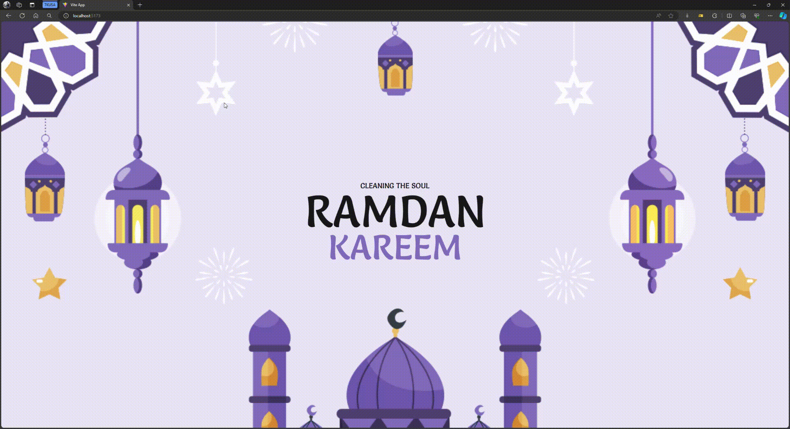

<h1>ANIMATES RAMADAN WEB BANNER</h1>

  
  

<h2>Agradecimientos: <strong> <a href="https://www.youtube.com/@bridgecode">Bridge Code</a> </strong></h2>
<a href="https://www.youtube.com/watch?v=YgqaBCTLTpM&list=WL&index=11&ab_channel=BridgeCode">Video tutorial</a>
